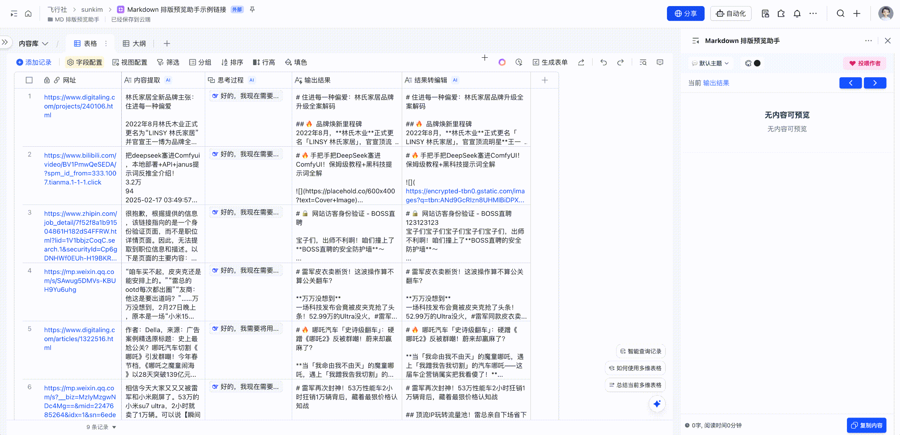

# Markdown 报告预览助手

<p align="center">
  
</p>

<div align="center">

**即时预览 Markdown 长报告和一键转换 PDF 格式文件导出**

</div>

<p align="center">
  
</p>

## 🌟 功能介绍

<p align="center">
  
</p>

### 为什么选择 Markdown 报告预览助手？

还在为表格中过长的报告内容而烦恼吗？需要反复拖动、切换窗口才能阅读全文？

这款 Markdown 报告预览工具将彻底解决您的痛点。它专为学生、研究人员、HR 及猎头等学术与职场人士设计，让您告别繁琐操作，专注于内容本身，显著提升工作效率。

### 核心功能

- **即时预览**：点击单元格，立即预览 Markdown 长文报告
- **一键导出**：支持导出 PDF 格式文件
- **简单操作**：无需复杂设置，即开即用
- **场景丰富**：适用于人才评估报告、学术实验报告等各类长篇文档

## 🚀 使用场景

- 📚 学术研究报告
- 👥 人才评估报告
- 🔬 实验研究报告
- 📊 数据分析报告
- 📝 项目总结报告

## 🔜 未来规划

我们正在全力开发更多激动人心的功能：

- 📑 更多报告模板
- 📎 更多导出格式（Word、图片等）
- 🎨 更丰富的样式定制
- 🔄 更智能的排版功能

## 👥 加入我们

<p align="center">
  
</p>

<p align="center">
  扫描上方二维码，立即加入官方用户群
</p>

## 🛠️ 技术栈

- React + TypeScript
- Vite
- Tailwind CSS
- Markdown 解析引擎

## 📝 开发指南

```bash
# 安装依赖
pnpm install

# 启动开发服务器
pnpm dev

# 构建生产版本
pnpm build
```

## 📄 许可证

[MIT License](LICENSE)

<p align="center">
  Made with ❤️ by Casper & Sunkim
</p> 